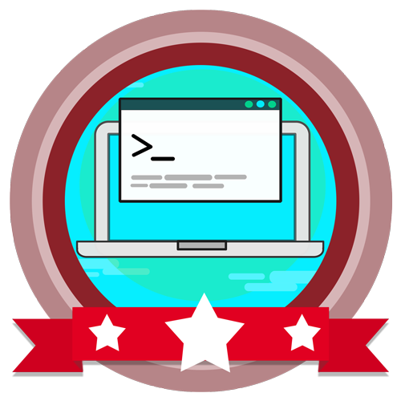

<!-- Badges session -->

  
  <!-- languages -->
  
  <!-- repo size -->
  
  <!-- last commit -->
  
  <!-- licence MIT -->
  

<!--Banner session-->

  

<!--About session-->
<h1 align="center">Crie seu gerenciador de salas de reuniões com Java e Angular Digital Innovation One</h1>

Curso do Bootcamp Java Developer da [Digital Innovation One](https://digitalinnovation.one/).

Neste Labs iremos desenvolver uma API com Spring Boot para gerenciar nossas salas de reunião, utilizaremos o Spring Data para persistência de dados e o banco in-memory H2. E o Front End que irá consumir essa API será uma SPA escrita em Angular.

<!--License session-->
<h3>📝 Licença</h3>

- Este projeto está sob a licença [MIT](./LICENSE).

<!--Bottom session-->
 <h4 align=center>Made with by <a target="_blank" href="https://pleiterson.vercel.app" >Pleiterson Amorim</a></h4>
